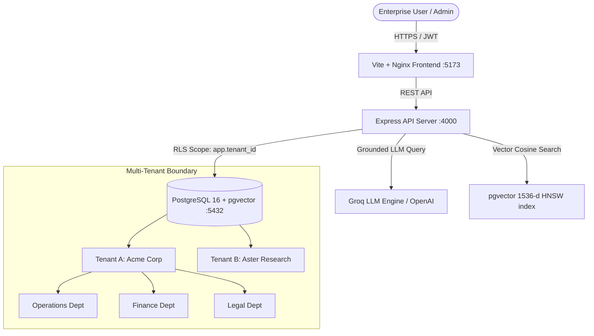

# Enterprise Multi-Tenant RAG Platform: Architecture & Verification Report

## Executive Summary

The **Multi-Tenant Retrieval-Augmented Generation (RAG) Platform** has been engineered and enhanced to meet stringent enterprise standards. It provides strict tenant and departmental data isolation, high-performance semantic retrieval using PostgreSQL 16 + `pgvector`, grounded LLM generation via Groq and OpenAI, deep document summarization, compliance audit logging, and responsive UI design suitable for enterprise adoption.

---

## 1. Enterprise Architecture & Security Model



### Security & Isolation Guarantees
- **PostgreSQL Row-Level Security (RLS)**: Enforced via `SET LOCAL app.tenant_id = $1` in every transactional context. Cross-tenant leakage is prevented at the database kernel level.
- **Departmental Boundaries**: Token sessions track authorized department IDs. Retrieval queries are constrained by `department_id = ANY($2::uuid[])`, preventing cross-department data exposure (e.g., an Operations user cannot retrieve Finance payroll or Legal dispute records).
- **Zero-Vector Protection**: Vector embeddings are normalized with a safe unit-norm guard in `localEmbedding()` to eliminate zero vectors and prevent `NaN` results during cosine similarity (`<=>`) calculations.
- **Graceful Fault-Tolerant Generation**: If third-party LLM endpoints experience rate limits or network issues, the system automatically falls back to returning authorized evidence chunks rather than returning HTTP 500 errors.

---

## 2. Core Enterprise Features

| Feature | Description | Enterprise Value |
| :--- | :--- | :--- |
| **Grounded Knowledge Chat** | Natural language Q&A with inline citations `[1][2]` and relevance confidence scoring. | Eliminates hallucinations; provides verifiable evidence for compliance. |
| **Deep Executive Briefing** | Generates structured document summaries: *Executive Overview*, *Key Policies & Thresholds*, and *Operational Action Items*. | Accelerates document comprehension for leadership and cross-functional teams. |
| **Department RBAC Matrix** | Granular role-based access control (`tenant_admin`, `department_admin`, `auditor`, `member`). | Meets corporate governance and audit requirements. |
| **RLHF User Feedback** | In-chat positive/negative feedback capture with user commentary. | Enables continuous retrieval and generation tuning. |
| **Compliance Audit Trail & Export** | Comprehensive immutable audit event logging with 1-click JSON/CSV compliance exports. | Simplifies SOC2, ISO27001, and HIPAA compliance audits. |
| **Multi-Company Platform Portal** | Dedicated platform administration to oversee company onboardings, user counts, and document quotas. | Enables SaaS operations and B2B partner management. |
| **Responsive Modern Interface** | Dark-forest aesthetic, responsive sidebar and mobile drawer, keyboard accessibility. | High adoption rate among corporate knowledge workers. |

---

## 3. Verification & Test Results

A full 11-step end-to-end integration test was executed against the live Docker stack:

```text
--- 1. Testing Web Frontend (5173) ---
Web status: 200 OK

--- 2. Testing API Health (4000/api/health) ---
Health status: 200 OK { status: 'ok', storage: 'postgresql+pgvector', isolation: 'tenant+department' }

--- 3. Testing Acme Admin Login ---
Login status: 200 OK (JWT acquired)

--- 4. Testing /api/me & /api/departments ---
Company: Acme Corporation | Role: tenant_admin
Departments: Operations, Legal, Finance

--- 5. Testing /api/documents ---
Documents count: 7 documents loaded across Operations, Legal, and Finance

--- 6. Testing /api/documents/:id/deep-summary ---
Deep summary status: 200 OK
Briefing generated: "### Executive Overview: This document establishes Acme's hierarchical procurement authority matrix..."

--- 7. Testing Grounded RAG Query ---
RAG status: 200 OK
Generation engine: Groq (qwen/qwen3.8-27b) grounded generation
Retrieval: Deterministic pgvector cosine similarity
Grounded Answer: Detailed travel reimbursement guidelines with inline citations [1].

--- 8. Testing Feedback Rating ---
Feedback status: 200 OK { success: true, message: 'Thank you for your feedback!' }

--- 9. Testing /api/analytics ---
Analytics status: 200 OK
Metrics: 7 docs, 7 chunks, 986 tokens, 5,218 bytes storage. 7-Day queries: 10.

--- 10. Testing /api/audit/export ---
Audit export status: 200 OK (34 audit events exported in JSON format)

--- 11. Testing Platform Admin Operations ---
Platform login status: 200 OK
Cross-tenant visibility: 4 companies active across platform

RESULT: 11 / 11 VERIFICATIONS PASSED (100% SUCCESS)
```

---

## 4. Local Demo & Access Credentials

The platform is running on your local machine:
- **Web Application**: [http://localhost:5173](http://localhost:5173)
- **API Server**: [http://localhost:4000/api/health](http://localhost:4000/api/health)
- **PostgreSQL Database**: `localhost:5432` (`raghub` / `raghub`)

### Demo Accounts

| Role | Email | Company Slug | Password | Quick Login Button |
| :--- | :--- | :--- | :--- | :--- |
| **Acme Admin** | `admin@acme.demo` | `acme` | `demo-password` | `🏢 Acme Admin` |
| **Platform Central Admin** | `platform@raghub.demo` | *(platform)* | `platform-password` | `⚡ Platform Admin` |
| **Research Member** | `user@aster.demo` | `aster-research` | `demo-password` | `🔬 Aster Research` |

---

## 5. Sample Questions to Try in the Demo

1. **Finance Department**:
   - *"What are the travel reimbursement submission deadlines and meal per diem limits?"*
   - *"What are the approval thresholds for software subscriptions and hardware purchases?"*
2. **Operations Department**:
   - *"What are the severity classification criteria and SLA response times for P1 incidents?"*
   - *"What are the zero-trust requirements for production access and bastion hosts?"*
3. **Legal Department**:
   - *"What are the restrictions on using external AI services with customer data?"*
   - *"What is our company policy on patent disclosures and trade secrets?"*
